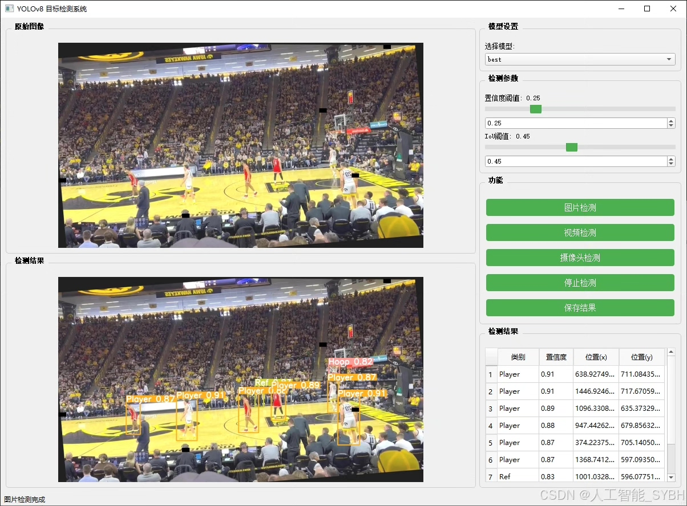
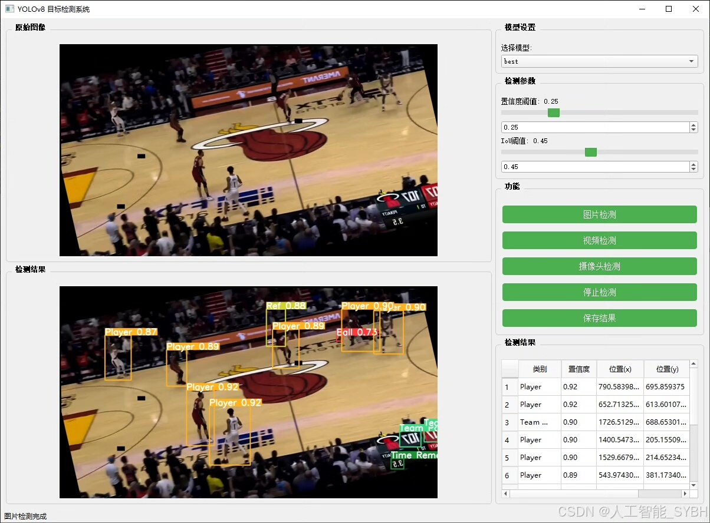
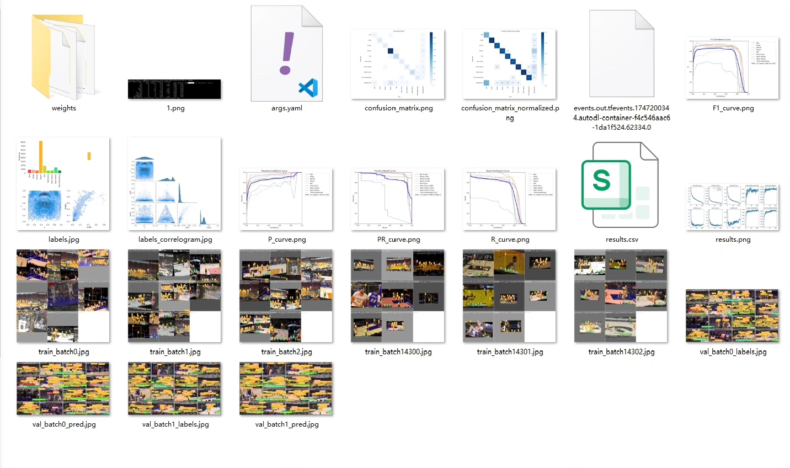
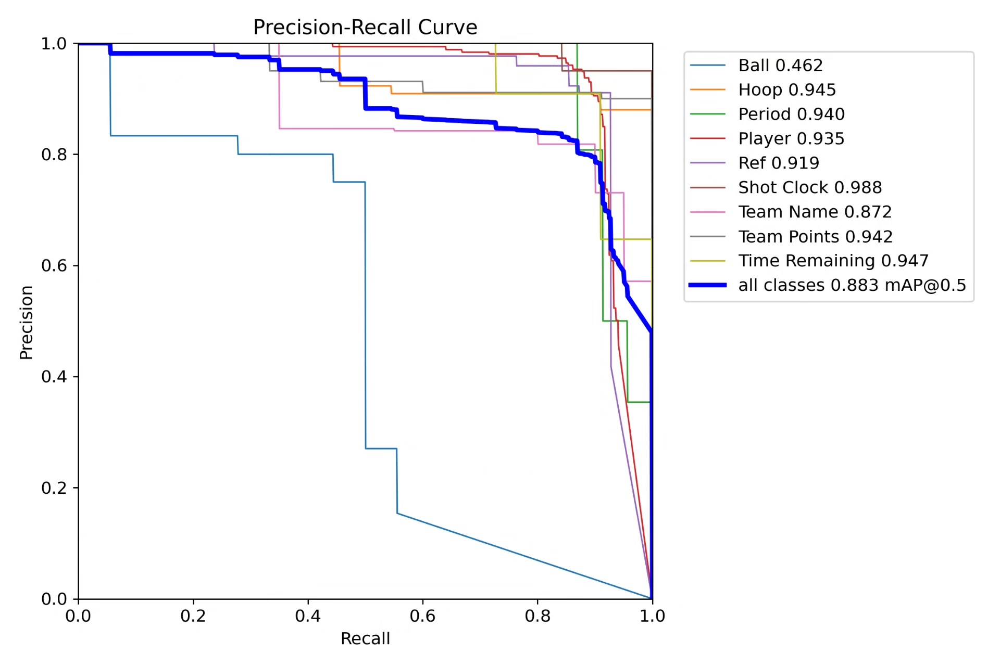
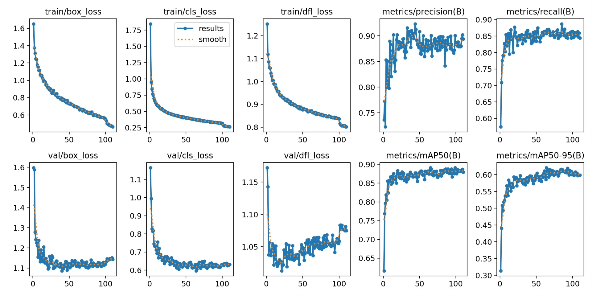
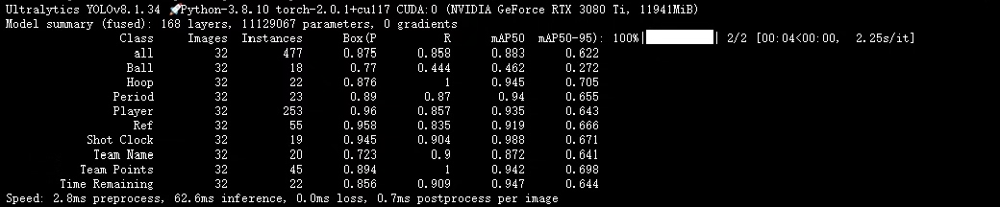
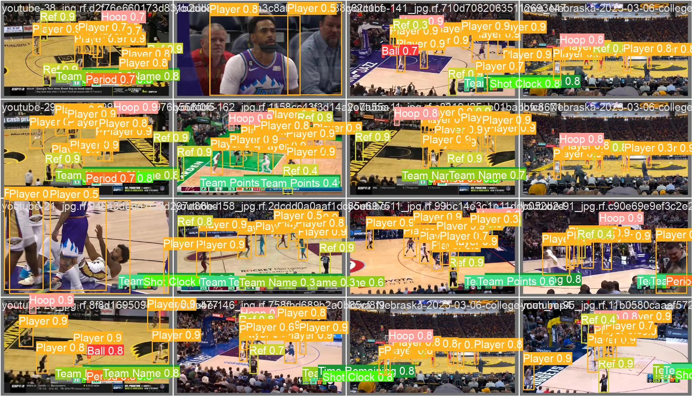
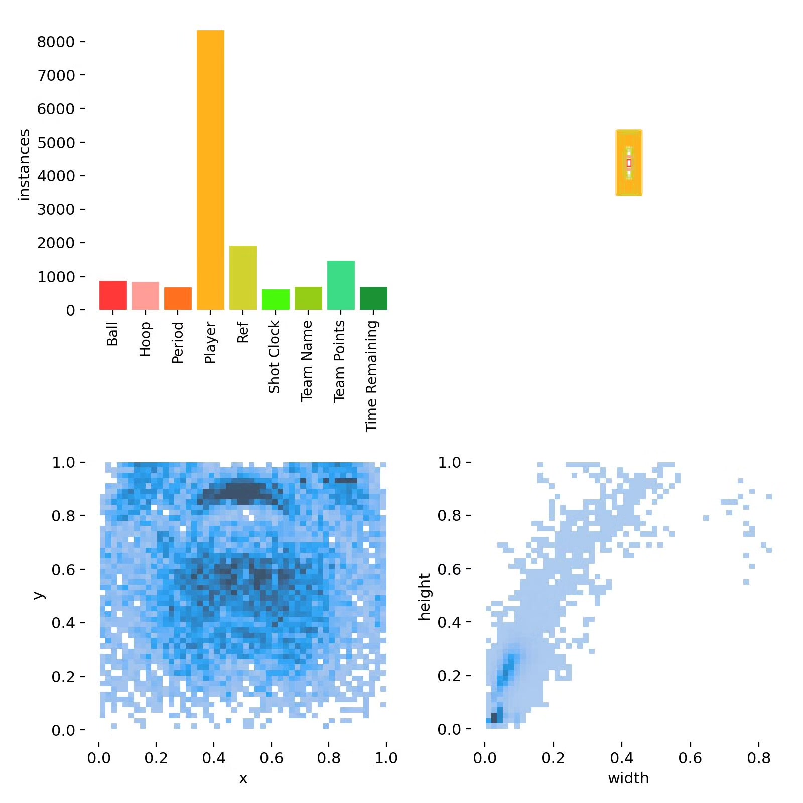

# Basketball Player Detection System Based on Deep Learning YOLOv8+

## Body

Based on the YOLOv8 object detection algorithm, this project has developed a professional basketball game scene intelligent analysis system. It can detect and recognize 9 key elements in real-time during the game: Basketball (Ball), Hoop, Game Period, Player, Ref, Shot Clock, Team Name, Team Points, and Time Remaining. The system uses a dataset containing 1,196 labeled images for training and evaluation, with 1,140 training images, 32 validation images, and 24 test images.

The company's products have been granted the official commercial license certification by YOLO.

We provide after-sales service.

After payment, we will provide WeChat IDs to answer questions anytime.

Environment configuration: We will provide an environment configuration tutorial, and WeChat will provide answers.

Remote installation services: If you need remote configuration, an additional fee of 69 is required.
If the configuration fails, all fees will be refunded (specially for old computers only refund installation fees).

Retraining dataset: After configuring the environment, you can train on your own computer.
If you need us to retrain, just pay 69 + computing power fees (2.5 yuan/hour)

## Images

## Payment

Here is a pay link on Stripe ( https://buy.stripe.com/3cs8yP7sY87d0vu9AB ). Please contact me lonlonago@foxmail.com after funding $89, and I will send you a complete data files , thank you!

